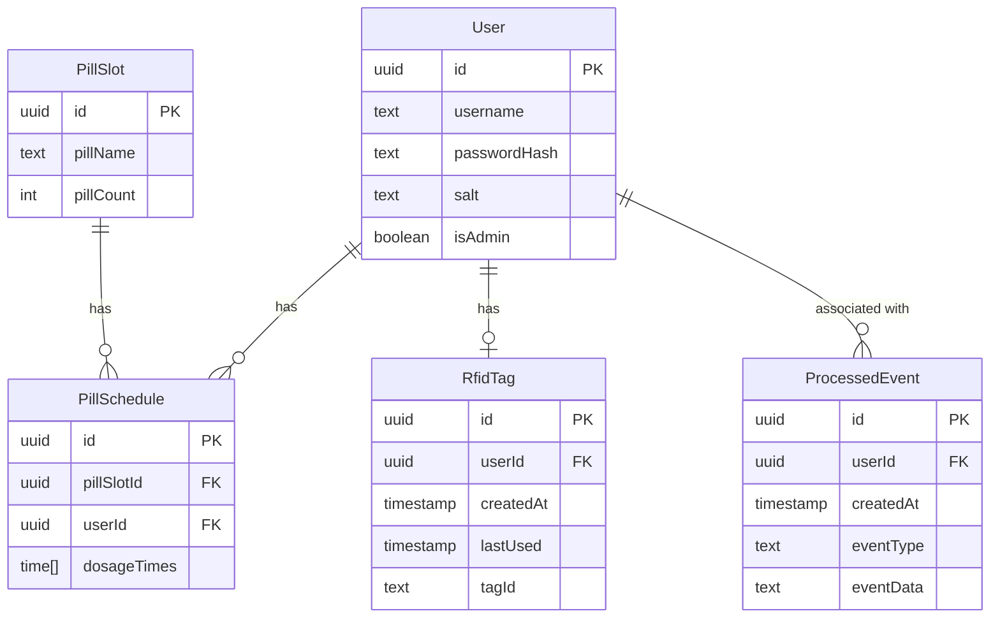

DB diagram

```mermaid
erDiagram
    PillSlot {
        uuid id PK
        text pillName
        int pillCount
    }

    PillSchedule {
        uuid id PK
        uuid pillSlotId FK
        uuid userId FK
        time[] dosageTimes
    }

    User {
        uuid id PK
        text username
        text passwordHash
        text salt
        boolean isAdmin
    }

    RfidTag {
        uuid id PK
        uuid userId FK
        timestamp createdAt
        timestamp lastUsed
        text tagId
    }

    ProcessedEvent {
        uuid id PK
        uuid userId FK
        timestamp createdAt
        text eventType
        text eventData
    }

    PillSlot ||--o{ PillSchedule : has
    User ||--o{ PillSchedule : has
    User ||--o| RfidTag : has
    User ||--o{ ProcessedEvent : "associated with"
```
